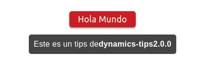
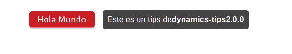
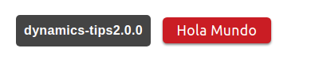
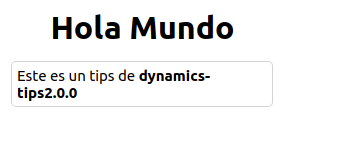
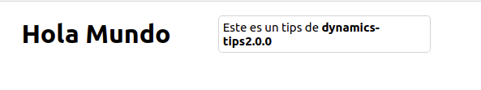
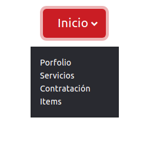
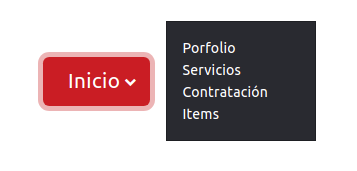

# Dynamics Tips

Elementos dinámicos para páginas web incluye Dropdown, comentarios dinámicos, tooltips y personalizados.

[](https://github.com/FedericoManzano/dynamics-tips2)

[](https://github.com/FedericoManzano/dynamics-tips2/blob/master/LICENSE)

## Contenido

- [Estructura](https://github.com/FedericoManzano/dynamics-tips2#estructura)
- [CDN](https://github.com/FedericoManzano/dynamics-tips2#cdn)
    - [CDN Estilos](https://github.com/FedericoManzano/dynamics-tips2#archivo-de-estilos-dynamicsmincss)
    - [CDN js](https://github.com/FedericoManzano/dynamics-tips2#archivo-de-javascript-dynamicsminjs)
    - [Template](https://github.com/FedericoManzano/dynamics-tips2#template)
- [Instalación](https://github.com/FedericoManzano/dynamics-tips2#instalaci%C3%B3n)
- [Vue / React](https://github.com/FedericoManzano/dynamics-tips2#en-vue-o-react)
- [Instrucciones](https://github.com/FedericoManzano/dynamics-tips2#instrucciones)
    - [Tips](https://github.com/FedericoManzano/dynamics-tips2#tips)
        - [Posiciones](https://github.com/FedericoManzano/dynamics-tips2#posiciones-data-position)
        - [Eventos](https://github.com/FedericoManzano/dynamics-tips2#eventos-data-evt)
        - [Información](https://github.com/FedericoManzano/dynamics-tips2#informaci%C3%B3n-data-info)
        - [Capturas](https://github.com/FedericoManzano/dynamics-tips2#capturas)
    - [Comentarios](https://github.com/FedericoManzano/dynamics-tips2#comment)
        - [Capturas](https://github.com/FedericoManzano/dynamics-tips2#capturas-1)
        - [AttrData](https://github.com/FedericoManzano/dynamics-tips2#attr-data)
- [Dropdown](https://github.com/FedericoManzano/dynamics-tips2#dropdown)
    - [Capturas](https://github.com/FedericoManzano/dynamics-tips2#capturas-2)


## Estructura

```
| > dynamics-tips
    | dist
        | css
            | fonts
                * fuentes de los íconos
            * dynamics.css
            * dynamics.min.css
            * dynamics.css.map
        | js 
            * dynamics.js
            * dynamics.min.js
    | node_modules `Dependencias instaladas`
    | sass
        | var
            * _global.scss
        * _comment.scss
        * _dropdown.scss
        * _icons.scss
        * _tips.scss
        * dynamics.scss
    | src
        | moduls
            | position
                * BottomDirection.js
                * TopDirection.js
                * LeftDirection.js
                * RightDirection.js
                * Direction.js
                * Position.js
                * Offset.js
            * Comment.js
            * Dropdown.js
            * Personal.js
            * Tips.js
            | test
                (Test Unitarios)
        * app.js
        * dynamics.js (main de la lib)
    * babel.config.json
    * LICENSE
    * package.look.json
    * package.json
    * REASME.md
    * webpack.config.js

```

## CDN 

Podemos incorporar la librería a través de su CDN.

### Archivo de estilos dynamics.min.css
```html
<link rel="stylesheet" href="https://rawcdn.githack.com/FedericoManzano/dynamics-tips2/5b1314c0aff6b0f02a9fa77ceee9f0e5b5c0a6f1/dist/css/dynamics.min.css">
```

### Archivo de javascript dynamics.min.js

```html
<script src="https://rawcdn.githack.com/FedericoManzano/dynamics-tips2/5b1314c0aff6b0f02a9fa77ceee9f0e5b5c0a6f1/dist/js/dynamics.min.js"></script>
```

### Template

```html
<!DOCTYPE html>
<html lang="es">
<head>
    <meta charset="UTF-8">
    <meta http-equiv="X-UA-Compatible" content="IE=edge">
    <meta name="viewport" content="width=device-width, initial-scale=1.0">

    <!-- Link a los estilos necesarios para los componentes -->
    <link rel="stylesheet" href="https://rawcdn.githack.com/FedericoManzano/dynamics-tips2/5b1314c0aff6b0f02a9fa77ceee9f0e5b5c0a6f1/dist/css/dynamics.min.css">
    <title>Hola Mundo</title>
</head>
<body>

    <!--  ACA VA EL CÖDIGO DE LA PÁGINA -->

    <h1 class="tips-ele" style="width:20%"
        data-position="bottom"
        data-info="Este es un tips de <strong>dynamics-tips2.0.0</strong>" >
     Hola Mundo
    </h1>


    <!-- JQUERY min -->
    <script src="https://code.jquery.com/jquery-3.6.0.min.js"></script>

    <!-- dynamics.min.js -->
    <script src="https://rawcdn.githack.com/FedericoManzano/dynamics-tips2/5b1314c0aff6b0f02a9fa77ceee9f0e5b5c0a6f1/dist/js/dynamics.min.js"></script>

    <script>
        // Inicializa los componentes por defecto
        Dynamics.init()
    </script>
</body>
</html>
```
## Instalación

A través de los gestores de paquetes de NodeJs.

```
npm install dynamics-tips
```
```
yarn add dynamics-tips 
```
```
git clone https://github.com/FedericoManzano/dynamics-tips2
```
[dynamics-tips2.zip descarga](https://github.com/FedericoManzano/dynamics-tips2/archive/refs/heads/master.zip)

### En Vue o React

Se puede agregar directamente los archivos `js` del directorio build.

```js
// Archivos Transpilados a js
import Dropdown from "dynamics-tips/src/moduls/Dropdown" 
import Comment from "dynamics-tips/src/moduls/Comment" 
import Tips from "dynamics-tips/src/moduls/Tips" 
import Personal from "dynamics-tips/src/moduls/Personal" 

// ... Ciclo de vida del componente despues 
// ... inicializada la vista

Dropdown.init()
Comment.init()
Tips.init()
Personal.init()
```
## Instrucciones

### Tips

Para agregar los tips a un elemento de la página tenemos que utilizar la clase `.tips-ele` al elemento disparador luego al mismo elemento añadir los atributos `data-info` y `data-position` de manera tal de pasarle a la función correspondiente los datos necesarios.

```html
<!-- Codigo de la página-->
<div class="container mt-3">
    <a class="btn btn-force tips-ele" data-position="left" data-evt="click"data-info="<strong>dynamics-tips2.0.0</strong>" >
        Hola Mundo
    </a>
</div>
```

En el pie de la página antes de cerrar el body agregamos el siguiente codigo para que funcione.

```html
    <script>
        Dynamics.initTips()
    </script>
</body>
</html>
```

#### Posiciones (data-position)
- Left
- Right
- Top
- Bottom

#### Eventos (data-evt)
- hover
- click

#### Información (data-info)
- Informacion que se quiere mostrar

#### Capturas








### Comment

Para agregar los tips a un elemento de la página tenemos que utilizar la clase `.com` al elemento disparador luego al mismo elemento añadir los atributos `data-info` y `data-position` de manera tal de pasarle a la función correspondiente los datos necesarios. También podemos utilizar `data-evt` para definir el evento que se dispara este puede ser hover o click.

```html 
<h1 class="com" style="width:20%"
    data-position="bottom"
    data-info="Este es un tips de <strong>dynamics-tips2.0.0</strong>" 
    data-evt="click" 
    data-class="clase">
    Hola Mundo
</h1>
```

En el pie de la página antes de cerrar el body agregamos el siguiente codigo para que funcione.

```html
    <script>
        Dynamics.initTips()
    </script>
</body>
</html>
```

#### Capturas





#### Attr Data

A través de estos atributos podemos configurar la posición, el evento disparador y la información del comentario dinámicos. En el elementos disparador utilizamos los attr `data-info`, `data-evt`, `data-position`.

- data-position 
    - buttom / abajo
    - top / arriba
    - left / izquierda
    - right / derecha
- data-evt
    - hover
    - click
- data-info
    - (información a mostrar texto plano o html)
 

### Dropdown

Despliega una lista dinámica con enlaces a determinados lugares de la página o sitio en desarrollo por lo general estas listas ocupan mucho espacio en el documentos de esta forma podemos desplegar una lista y hacerla desaparecer cuando no la necesitemos.

```html

<!-- 
    El attr data-target apunta a la lista desplegable y el objeto disparador
    tiene la clase (.dropdown-trigger).
-->
<div class="container mt-8">
    <a href="#" class="dropdown-trigger btn-lg btn-force" data-target="#drop" data-position="bottom">Inicio</a>
</div>

 <!-- 
    El id puede ser opcional pero tiene que ser el 
    mismo que el configurado en data-target
    ----------------------------------------------------
    La clase agregada el la lista es dropdown-list-[color]
    donde color es un parámetro para definir el color de la lista
    en este caso dark. 
 -->   
<div id="drop" class="dropdown-list-dark ">
    <ul class="list">
        <li><a href="#">Porfolio</a></li>
        <li><a href="#">Servicios</a></li>
        <li><a href="#">Contratación</a></li>
        <li><a href="#">Items</a></li>
    </ul>
</div>
```

#### Capturas





- data-position 
    - buttom / abajo
    - top / arriba
    - left / izquierda
    - right / derecha
- data-target
    - id de la lista a desplegar

#### Colores

- dark
- pasture
- cure 
- gentle 
- death
- force
- fish
- toxic
- grey

### Toast

Elementos dinámicos que muestran el resultado de determinado evento generado por el usuario. Dependiendo el resultado va a mostrar un `toast` con determinadas características para informar al usuario sobre el evento recientemente generado.

```html 
<!DOCTYPE html>
<html lang="es">
<head>
    <meta charset="UTF-8">
    <meta http-equiv="X-UA-Compatible" content="IE=edge">
    <meta name="viewport" content="width=device-width, initial-scale=1.0">

    <!-- Link a los estilos necesarios para los componentes -->
    <link rel="stylesheet" href="../dist/css/dynamics.css">

    <style>
        /**
            Clases css para añadire a l toast
        */
        .borde {
            border-radius:   20px;  
        }

        .texto {
            font-weight:     600;
            color:          orange;
        }

    </style>

   

    <title>TOAST</title>
</head>
<body>

    <!-- LLama  a la función que despliega el Toast-->
    <button onclick="testToast()">Boton</button>


    <!-- dynamics.min.js -->
    <script src="../dist//js/dynamics.js"></script>

    <script>
        // Inicializa los componentes por defecto
        Dynamics.init()

        function testToast() {
            /**
             *  Confira el toast
             * */
            const conf = {
                html: "Esto es un toast personalizado", // texto a mostrar
                bg: "#181C22", // color de fondo del toast por defecto es negro
                color: "white",// Color del texto de toast por defecto el blanco
                classes: [ // clases css definidas por el usuario por defecto no hay
                    "texto", 
                    "borde"
                ]
            }
            // LLama al método estático para imprimir el toast
            Dynamics.toast(conf)
        }
    </script>
</body>
</html>
```

#### Atributos configuración

- html: Texto o Html con la info a mostrar
- bg: Color de fondo del Toast Hexadecimal
- color: Color del texto Hexadecimal
- classes: [] nombre de las clases css para darle estilos al toast.


### Personalizados

Elementos similires a los tips pero con la posibilidad de darle estilos. No vienen con estilos definidos el usuario debe pasarle una clase CSS para que através de ella el elemento tome forma.

```html
<!DOCTYPE html>
<html lang="es">
<head>
    <meta charset="UTF-8">
    <meta http-equiv="X-UA-Compatible" content="IE=edge">
    <meta name="viewport" content="width=device-width, initial-scale=1.0">


    <style>

        /**
            Clase para pasar por parámetro
        */
        .claseAVincular {
            padding: 5px;
            font-size: 14px;
            background-color: rgba(0, 0, 0, 0.788);
            text-align: center;
            max-width: fit-content;
            position: absolute;
            color: white;
        }
    </style>


    <!-- Link a los estilos necesarios para los componentes -->
    <link rel="stylesheet" href="../dist/css/dynamics.css">
    <title>Personalizados</title>
</head>
<body>

     <button class="personal" data-position="top" data-class="claseAVincular" data-evt="hover">Botón Disparador</button>


    <!-- JQUERY min -->
    <script src="https://code.jquery.com/jquery-3.6.0.min.js"></script>

    <!-- dynamics.min.js -->
    <script src="../dist/js/dynamics.js"></script>

    <script>
        // Inicializa los componentes por defecto
        Dynamics.init()
    </script>
</body>
</html>
```

Los attr son los mismo a los de los tips la única diferencia es el attr data-class con el valor de la clase CSS personalizada obligatoria para su funcionamiento.

## LICENCIA

[MIT](https://github.com/FedericoManzano/dynamics-tips2/blob/master/LICENSE)

Dynamics Tips © derechos reservados.

